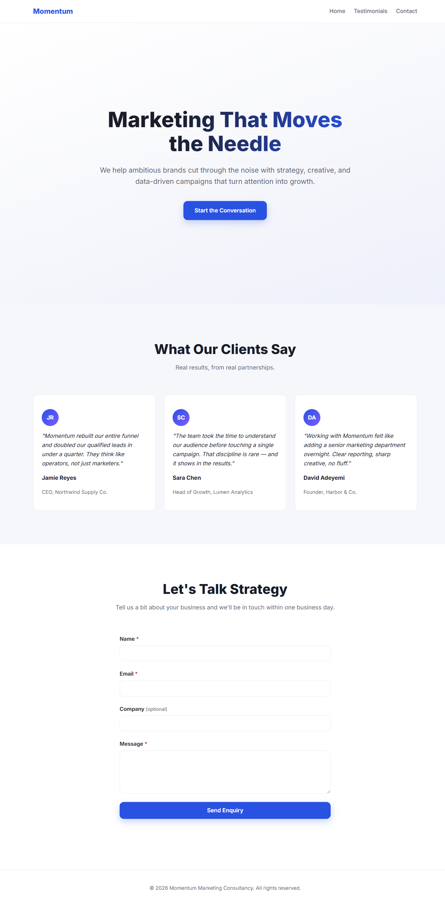

# Momentum Marketing Consultancy

A static, single-page marketing website: hero section, testimonials, and a contact/enquiry form. No build tooling, no package manager, no framework.



## Structure

- `index.html` — all markup (nav, hero, testimonials, contact form, footer)
- `styles.css` — all styling, mobile-first with breakpoints via `@media (min-width: ...)`
- `script.js` — smooth-scroll nav and the enquiry form's client-side validation + FormSubmit.co submission

## Running locally

There's no build step. Either open `index.html` directly in a browser, or serve the directory with any static file server, e.g.:

```bash
npx serve .
```

## Contact form setup

The enquiry form submits via `fetch()` as JSON to [FormSubmit.co](https://formsubmit.co/), no signup required. The endpoint in [script.js](script.js) points at the destination email:

```js
const FORM_ENDPOINT = 'https://formsubmit.co/ajax/your-address@example.com';
```

FormSubmit.co sends a one-time confirmation email to that address on first submission — it must be clicked to activate the form.

Validation (required fields + a basic email regex) happens client-side only, in `script.js`, before the network call — there is no server-side validation.

## Styling

Colors, spacing, and font are centralized as CSS custom properties in `:root` in `styles.css`. Prefer adjusting those variables over hardcoding new values when changing the look.

## Deployment

Pushes to `main` automatically deploy to GitHub Pages via [.github/workflows/deploy.yml](.github/workflows/deploy.yml).
